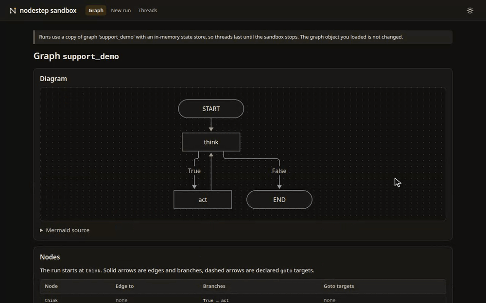

<picture>
  <source media="(prefers-color-scheme: dark)" srcset="docs/assets/nodestep-dark.svg">
  
</picture>

# nodestep

> [!WARNING]
> Alpha (0.1.0a1). Anything may change between releases without a deprecation period, so pin a tag or a commit.

An explicit, async-first graph framework for LLM agents in Python. Nodes are plain functions that read a typed state and return an update; nodestep runs the graph in steps, can store each step, pause for a person and continue later.



## Install

nodestep needs Python 3.12 or later. It is not on PyPI yet, so you install it from GitHub.

```bash
uv add "nodestep @ git+https://github.com/nodestep-ai/nodestep"
```

Optional extras:

- `openai`: `OpenAIChat`, the OpenAI chat integration.
- `sandbox`: `nodestep sandbox`, a local web page that runs a graph, shows each step and answers interrupts.
- `all`: both.

```bash
uv add "nodestep[openai] @ git+https://github.com/nodestep-ai/nodestep"
uv add --dev "nodestep[sandbox] @ git+https://github.com/nodestep-ai/nodestep"
```

The same requirements work with `pip install`.

To open a graph in the sandbox without adding anything to your project:

```bash
uvx --from "nodestep[sandbox] @ git+https://github.com/nodestep-ai/nodestep" nodestep sandbox app.py:graph
```

`app.py:graph` is the file and the graph variable in it.

## Quick start

A refund of 50 or less is approved; a larger one waits for a person. No API key is needed.

```python
from nodestep import END, START, BaseState, Graph, InMemoryStateStore, Resume
from nodestep import interrupt, node, when


class Refund(BaseState):
    amount: float = 0.0
    approved: bool = False


@node
def check(state: Refund) -> dict:
    return {"approved": state.amount <= 50}


@node
def review(state: Refund) -> dict:
    answer = interrupt(f"Approve a refund of {state.amount}?", id="approve_refund")
    return {"approved": answer}


def needs_review(state: Refund) -> bool:
    return not state.approved


graph = Graph(Refund, state_store=InMemoryStateStore()).flow(
    START >> check,
    check >> when(needs_review, review, otherwise=END),
    review >> END,
)

paused = graph.invoke({"amount": 80}, thread_id="refund-1")
print(paused.status, [item.payload for item in paused.interrupts.values()])

done = graph.invoke(None, thread_id="refund-1", resume=Resume(True))
print(done.status, done.state.approved)
```

The first call stops at `interrupt()` with the status `interrupted`; the second resumes the same thread with the answer.

- `when()` needs an `otherwise=` target, and `interrupt()` needs an `id`.
- With a state store, every run needs a `thread_id`.

The [Quickstart](https://nodestep-ai.github.io/nodestep/quickstart/) builds a graph like this one step by step: the state, the nodes, the flow, a run, a stream, a thread and a pause for a person.

## Documentation

https://nodestep-ai.github.io/nodestep/

To trace runs, see [nodeartifact](https://nodestep-ai.github.io/nodestep/nodeartifact/). For a full app built on nodestep, see [text-to-sql-demo](https://github.com/nodestep-ai/text-to-sql-demo).

## Development

```bash
git clone https://github.com/nodestep-ai/nodestep
cd nodestep
uv sync --locked --all-extras
uv run --no-sync pytest -q
uv run --no-sync ruff check .
uv run --no-sync ruff format --check .
uv run --no-sync ty check .
```

`--no-sync` keeps `uv run` from re-syncing the environment without the extras.

Changelog and release rules are in [CONTRIBUTING.md](https://github.com/nodestep-ai/nodestep/blob/main/CONTRIBUTING.md).

## License

MIT. See [LICENSE](https://github.com/nodestep-ai/nodestep/blob/main/LICENSE).
