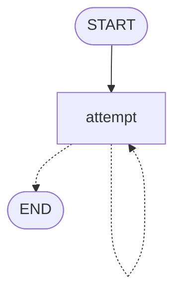

# Graphs and flow

A graph is a state type, the nodes that work on it, and a flow that says which node runs after which.

```python
from nodestep import END, START, BaseState, Graph, node


class Order(BaseState):
    total: float = 0.0
    shipping: float = 0.0


@node
def add_shipping(state: Order) -> dict:
    return {"shipping": 0.0 if state.total >= 50 else 4.9}


graph = Graph(Order, name="checkout").flow(
    START >> add_shipping,
    add_shipping >> END,
)

print(graph.invoke({"total": 20}).state.shipping)
```

```text
4.9
```

The state type is `Order`, the only node is `add_shipping`, and the flow runs that node once and ends.

## Create a graph

A `Graph` takes the state type first. The other settings are keyword-only: `name`, `max_steps`, `timeout`, `state_store`, `middleware` and `workspace`. Their defaults are in [Rules and defaults](#rules-and-defaults), and the full signature is in the [API reference](../reference/core/graphs.md#nodestep.core.Graph).

You then declare the flow in one `flow()` call, which returns the graph.

## Edges

An edge says which node runs next. You write it with `>>`:

- `START >> node` names the first node.
- `a >> b` runs `b` after `a`.
- `a >> END` ends the run after `a`.

Every node needs a way out: an edge, or one of the routes in the next two sections.

## Route on the state

A route picks the next node from the state. `branch(router, mapping)` calls the router with the state, and the run goes to the node that the returned key maps to.

```python
from nodestep import END, START, BaseState, Graph, branch, node


class Message(BaseState):
    text: str = ""
    language: str = ""
    reply: str = ""


@node
def detect(state: Message) -> dict:
    return {"language": "de" if state.text.startswith("Hallo") else "en"}


@node
def reply_de(state: Message) -> dict:
    return {"reply": "Guten Tag"}


@node
def reply_en(state: Message) -> dict:
    return {"reply": "Good day"}


def by_language(state: Message) -> str:
    return state.language


graph = Graph(Message).flow(
    START >> detect,
    detect >> branch(by_language, {"de": reply_de, "en": reply_en}),
    reply_de >> END,
    reply_en >> END,
)

print(graph.invoke({"text": "Hallo"}).state.reply)
```

```text
Guten Tag
```

For two targets, use `when(predicate, target, otherwise=other)`. The predicate gets the state and returns a `bool`. With a predicate `is_german`, the route above becomes `detect >> when(is_german, reply_de, otherwise=reply_en)`.

[Branch on the state](../guides/branching.md) walks through a complete router.

## Let a node choose the next step

A node can choose the next step itself. It returns `Command(goto=...)`, a `Send` or `END`. Every target it may reach is declared in `@node(goto=[...])`, so `flow()` can check it and the diagram can show it.

```python
from nodestep import END, START, BaseState, Command, Graph, node


class Job(BaseState):
    attempts: int = 0
    result: str = ""


@node(goto=["attempt", END])
def attempt(state: Job) -> Command:
    attempts = state.attempts + 1
    if attempts < 3:
        return Command(update={"attempts": attempts}, goto=attempt)
    return Command(update={"attempts": attempts, "result": "ok"}, goto=END)


graph = Graph(Job).flow(START >> attempt)

result = graph.invoke({})
print(result.state.attempts, result.state.result)
```

```text
3 ok
```

The node loops to itself, so its `goto` names it as a string. Use a string for a node that is defined later, too. [Nodes and context](nodes.md#command-and-send) explains `Command` and `Send`, and [Fan out with Send](../guides/fan-out.md) runs one node per item of a list.

## Checks when the flow is declared

`flow()` checks the whole flow at once. It raises one `GraphConfigError` that lists every problem.

```python
from nodestep import END, START, BaseState, Graph, GraphConfigError, node


class Job(BaseState):
    done: bool = False


@node
def first(state: Job) -> dict:
    return {}


@node
def second(state: Job) -> dict:
    return {}


@node
def orphan(state: Job) -> dict:
    return {}


try:
    Graph(Job).flow(START >> first, first >> second, orphan >> END)
except GraphConfigError as error:
    print(error)
```

```text
Graph 'graph' has an invalid flow:
- Node 'second' has no outgoing edge, branch or goto; end it with 'second >> END'
- Node 'orphan' is not reachable from START
```

The other checks are listed in [Rules and defaults](#rules-and-defaults).

## Draw the graph

`graph.to_mermaid()` returns a Mermaid flowchart. Solid arrows are edges, branch keys are labels, and dashed arrows are declared `goto` targets. The loop above draws as:



`graph.to_spec()` and `graph.to_json()` describe the same graph as data.

## Rules and defaults

| Rule or setting | What happens |
|---|---|
| `name` | `"graph"`. The name is used in errors, events and middleware contexts |
| `max_steps` | `25`: the superstep limit for one call, see [Running](execution.md) |
| `timeout` | `None`: no limit on the seconds one call spends inside supersteps |
| `state_store` | `None`: no threads, history or interrupts, see [Persistence and time travel](persistence.md) |
| `middleware` | `None`: no hooks around the graph, nodes, tools and model calls, see [Middleware](middleware.md) |
| `workspace` | `None`: no files for tools to read and change, see [Workspace and memory](workspace.md) |
| `START` edge | A flow has exactly one |
| Node without a way out | A node without an outgoing edge, branch or declared `goto` is an error |
| `when()` | Needs `otherwise=`; without it, the call raises `TypeError` |
| `when()` predicate | Gets the state and must return a `bool`; anything else raises `GraphExecutionError` when the run gets there |
| `branch()` key that is not in the mapping | The run fails with `GraphExecutionError`; there is no fallback |
| `branch()` mapping value | A node or `END` |
| `Command(goto=...)` | Replaces the node's edges for that run of the node; it does not add to them |
| `Command(goto=[])` | The node routes nowhere: no task follows it |
| `Command(goto=None)` | The default: the node follows its edges |
| Undeclared `goto` target | `GraphExecutionError` |
| Flow problems | `flow()` raises one `GraphConfigError` that lists every problem |
| A second `flow()` call, two edges from one node, two different nodes with the same name, a `goto` name that matches no node | `GraphConfigError` from `flow()` |
| Node name | The function's `__name__`, unless you pass `name=`. A lambda needs one, and a blank name raises `TypeError` |
| Node name in history | The name is the node's identity in stored history, see [Persistence and time travel](persistence.md#what-is-stored) |
| Mermaid node ids | Derived from node names (see `nodestep.core.render.mermaid_id`), so you can add your own `style` lines |
| Mermaid edge ids | `<from>-<to>`, with `-2`, `-3` for a repeated pair |
| `to_spec()` and `to_json()` | Describe the graph as data, with the import path of each node and router |
