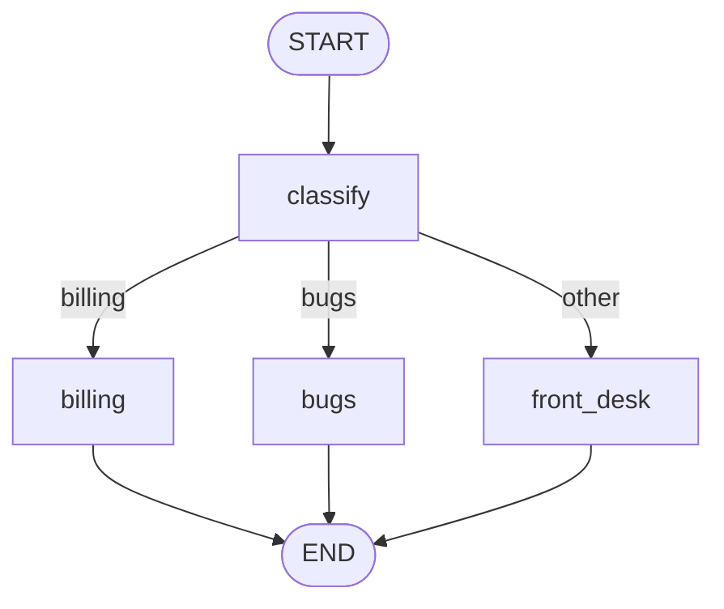

# Branch on the state

`when()` sends the run to one of two nodes and `branch()` to one of several, depending on the state after a node.

## When you need it

Use a route when what runs next depends on a node's result: an urgent ticket, the language of a message, or a category.

## Steps

1. Write a router: a function of the state that returns a `bool` for `when()`, or a key for `branch()`.
2. For two targets, put `a >> when(router, target, otherwise=other)` in `flow()`.
3. For more targets, put `a >> branch(router, {key: node, ...})` in `flow()`; a mapping value may be `END`.
4. Give every target its own way out, such as `target >> END`.
5. Check the routes with `graph.to_mermaid()`.

## Complete example

`classify` sets the topic of a support ticket, and `branch()` sends the ticket to one of three queues:

```python
from nodestep import END, START, BaseState, Graph, branch, node


class Ticket(BaseState):
    text: str = ""
    topic: str = ""
    queue: str = ""


@node
def classify(state: Ticket) -> dict:
    text = state.text.lower()
    if "invoice" in text:
        return {"topic": "billing"}
    if "error" in text:
        return {"topic": "bugs"}
    return {"topic": "other"}


@node
def billing(state: Ticket) -> dict:
    return {"queue": "billing team"}


@node
def bugs(state: Ticket) -> dict:
    return {"queue": "engineering"}


@node
def front_desk(state: Ticket) -> dict:
    return {"queue": "front desk"}


def by_topic(state: Ticket) -> str:
    return state.topic


routes = {"billing": billing, "bugs": bugs, "other": front_desk}

graph = Graph(Ticket, name="support").flow(
    START >> classify,
    classify >> branch(by_topic, routes),
    billing >> END,
    bugs >> END,
    front_desk >> END,
)

for text in ["Where is my invoice?", "The app shows an error", "Do you ship to Oslo?"]:
    result = graph.invoke({"text": text})
    print(f"{text} -> {result.state.queue}")
```

```text
Where is my invoice? -> billing team
The app shows an error -> engineering
Do you ship to Oslo? -> front desk
```

The router reads the state after `classify` has run. `graph.to_mermaid()` draws the flow, with the keys as labels:



## Good to know

- A key that is not in the mapping fails the run, with no fallback ([Rules and defaults](../concepts/graphs.md#rules-and-defaults)).
- A `when()` predicate must return a `bool`; anything else raises `GraphExecutionError` when the run gets there ([Rules and defaults](../concepts/graphs.md#rules-and-defaults)).
- A target without a way out raises `GraphConfigError` when `flow()` runs ([Rules and defaults](../concepts/graphs.md#rules-and-defaults)).
- A node can also choose its next step by returning `Command(goto=...)` ([Graphs and flow](../concepts/graphs.md#let-a-node-choose-the-next-step)).
