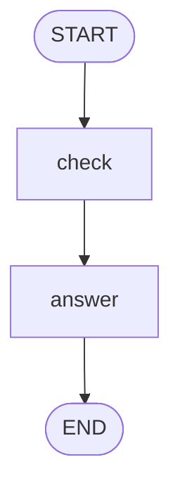

# Quickstart

This page builds one graph, a small refund desk, step by step: the state, the nodes, the flow, a run, a stream, a thread and a pause for a person.

Every block continues the one before it, so run them in order in one file or one Python session. No API key is needed; [Install](install.md) nodestep first.

## 1. Define the state

The state is the data the graph works on. Here it is a refund: the amount, whether it is approved, and the reply to the customer.

```python
from nodestep import BaseState


class Refund(BaseState):
    amount: float = 0.0
    approved: bool = False
    reply: str = ""


print(Refund())
```

```text
amount=0.0 approved=False reply=''
```

`BaseState` is a pydantic `BaseModel` with the default configuration. Any `BaseModel` or a `TypedDict` works too; see [State](concepts/state.md).

## 2. Write the nodes

A node is a function that reads the state and returns a dict with the fields it changes. `@node` turns the function into a node, and you can still call it directly.

<!-- continue -->

```python
from nodestep import node


@node
def check(state: Refund) -> dict:
    return {"approved": state.amount <= 50}


@node
def answer(state: Refund) -> dict:
    if state.approved:
        return {"reply": f"Your refund of {state.amount} is approved."}
    return {"reply": f"Your refund of {state.amount} is declined."}


print(check(Refund(amount=20)))
print(answer(Refund(amount=20, approved=True)))
```

```text
{'approved': True}
{'reply': 'Your refund of 20.0 is approved.'}
```

`check` approves a refund of 50 or less, and `answer` writes the reply. [Nodes and context](concepts/nodes.md) lists what a node can receive and return.

## 3. Connect the nodes

`flow()` declares every connection once: `START` to the first node, each node to the next, and the last node to `END`.

<!-- continue -->

```python
from nodestep import END, START, Graph

graph = Graph(Refund).flow(
    START >> check,
    check >> answer,
    answer >> END,
)

print(graph.to_mermaid())
```

`to_mermaid()` returns the flow as a [Mermaid](https://mermaid.js.org/) diagram:



If the flow has a mistake, such as a node without a way out, `flow()` raises `GraphConfigError` listing every problem. [Graphs and flow](concepts/graphs.md) shows routes, loops and fan-out.

## 4. Run the graph

`invoke()` runs the graph and returns a `GraphResult` with the status and the final state.

<!-- continue -->

```python
result = graph.invoke({"amount": 20})
print(result.status)
print(result.state.reply)
```

```text
completed
Your refund of 20.0 is approved.
```

[Running](concepts/execution.md) explains how a run proceeds.

## 5. Watch it run

`stream()` yields events while the graph runs. `stream_mode` picks the events and has no default. `"updates"` gives one event per node with its update, then a `"final"` event with the state.

<!-- continue -->

```python
for event in graph.stream({"amount": 80}, stream_mode="updates"):
    if event.mode == "updates":
        print(event.step, event.node, event.data)
    else:
        print(event.mode, event.data.state)
```

```text
0 check {'approved': False}
1 answer {'reply': 'Your refund of 80.0 is declined.'}
final {'amount': 80.0, 'approved': False, 'reply': 'Your refund of 80.0 is declined.'}
```

The graph runs in supersteps, counted from 0, and each event carries its `step`. In async code, use `ainvoke()` and `astream()`. [Streaming](concepts/streaming.md) lists every mode.

## 6. Keep a thread

A state store keeps the state of each thread between runs. With a store, every run needs a `thread_id`.

<!-- continue -->

```python
from nodestep import InMemoryStateStore

graph = Graph(Refund, state_store=InMemoryStateStore()).flow(
    START >> check,
    check >> answer,
    answer >> END,
)

graph.invoke({"amount": 20}, thread_id="refund-1")
print(graph.invoke({}, thread_id="refund-1").state.amount)
print(graph.invoke({}, thread_id="refund-9").state.amount)
```

```text
20.0
0.0
```

The second run on `refund-1` starts from the state the first run stored, so the amount is still 20.0. `refund-9` is a new thread, so it starts from the defaults. Input on a thread is a patch: it changes only the fields it names. [Persistence and time travel](concepts/persistence.md) shows history, forks and stores on disk.

## 7. Pause for a person

So far a refund above 50 is declined. Send it to a person instead: `interrupt()` pauses the node, and a later run with `resume=` gives the answer. Pausing needs a state store, so this graph keeps one.

<!-- continue -->

```python
from nodestep import Resume, interrupt, when


@node
def review(state: Refund) -> dict:
    decision = interrupt(f"Approve a refund of {state.amount}?", id="approve")
    return {"approved": decision}


def needs_review(state: Refund) -> bool:
    return not state.approved


graph = Graph(Refund, state_store=InMemoryStateStore()).flow(
    START >> check,
    check >> when(needs_review, review, otherwise=answer),
    review >> answer,
    answer >> END,
)

paused = graph.invoke({"amount": 80}, thread_id="refund-2")
print(paused.status)
for key, pending in paused.interrupts.items():
    print(key, pending.payload)

done = graph.invoke(None, thread_id="refund-2", resume=Resume(True))
print(done.status)
print(done.state.reply)
```

```text
interrupted
review:approve Approve a refund of 80.0?
completed
Your refund of 80.0 is approved.
```

`when(needs_review, review, otherwise=answer)` sends the run to `review` when `needs_review` returns `True`, and to `answer` when it returns `False`.

- Every `interrupt()` has an `id`. The key `review:approve` is the task and the id.
- `Resume(True)` answers the only pending interrupt. With several pending, pass `Resume(answers={key: value, ...})`.
- On resume the node runs again from the top, and `interrupt()` returns the answer.
- New input on a paused thread raises `ResumeError`. Continue the thread with `invoke(None, ..., resume=...)`.

[Interrupts](concepts/interrupts.md) covers several interrupts, answers in code and tool approvals.

## Next steps

- The Core concepts pages explain each part: [Graphs and flow](concepts/graphs.md), [State](concepts/state.md), [Nodes and context](concepts/nodes.md) and [Running](concepts/execution.md).
- [Agents and tools](concepts/agents.md) adds a chat model and tools, with `ScriptedChat` playing the model, so you need no key.
- The How-to pages each solve one task, such as [Branch on the state](guides/branching.md), [Fan out with Send](guides/fan-out.md) and [Pause for approval](guides/approval.md).
- [Run the examples](examples.md) lists the scripts in `examples/`.
- [Use the sandbox](guides/sandbox.md) to open any of these graphs in a local web page.
